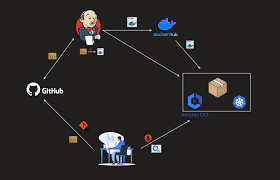
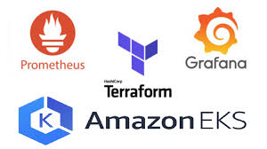
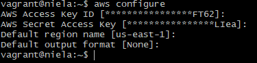
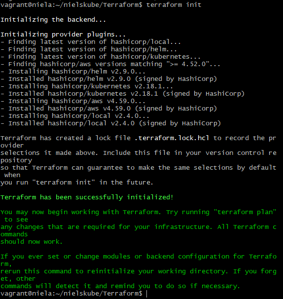
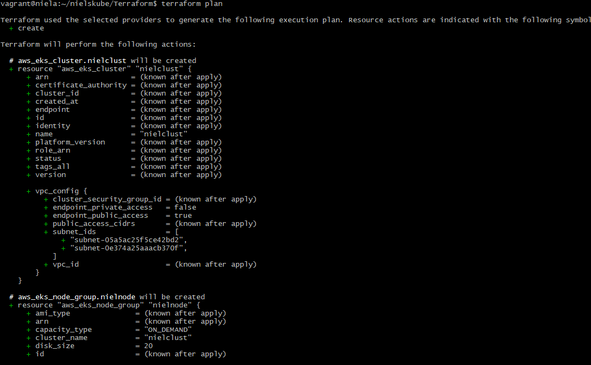
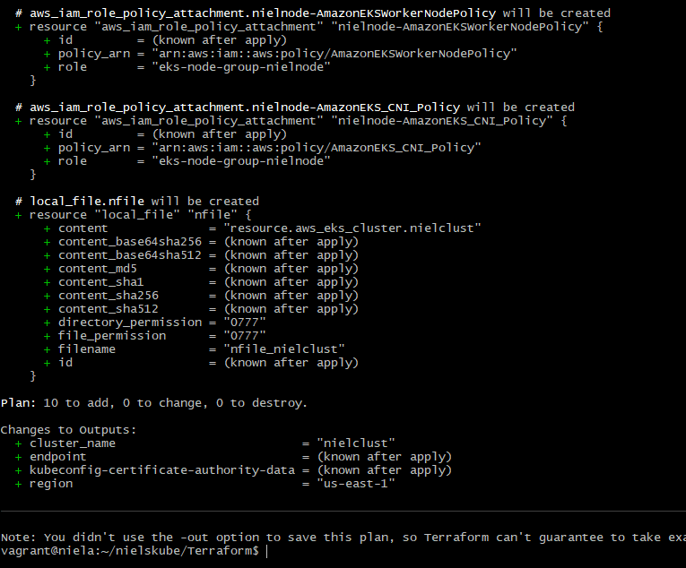
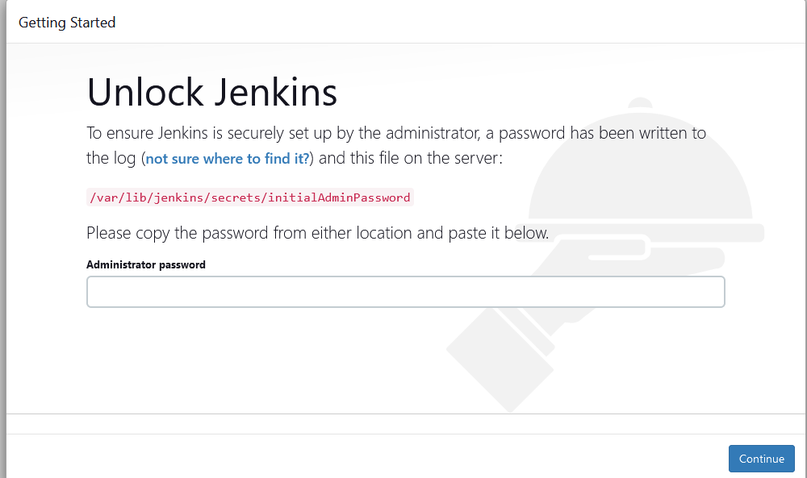
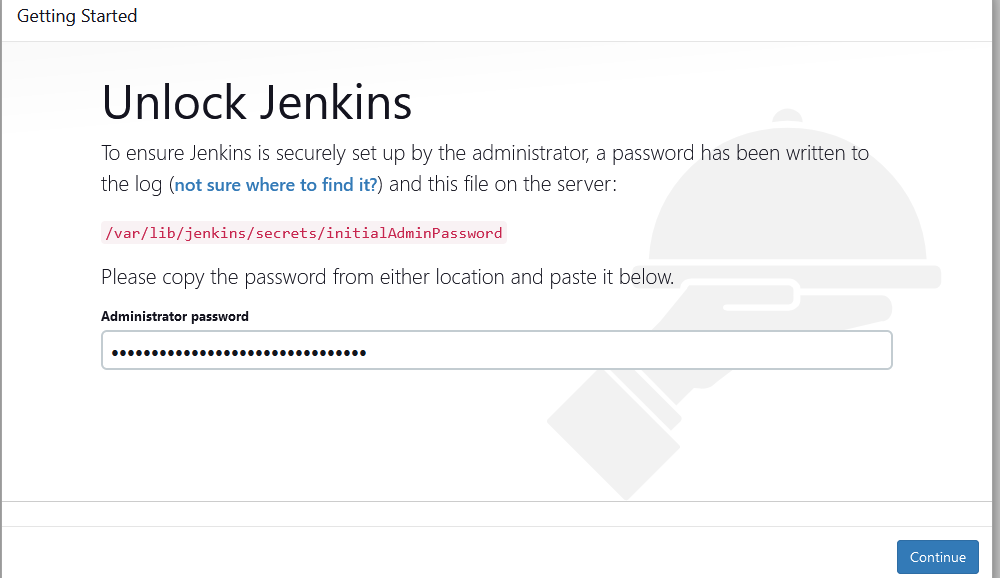
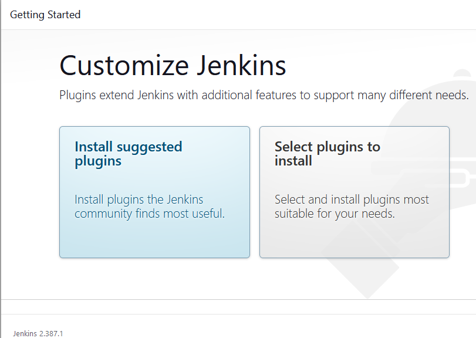

Where do I start from?

HOW TO DEPLOY SAMPLE APPS ON EKS USING TERRAFORM AND JENKINS ON A LINUX SERVER.



<br> </br>

For the the purpose of this, we will be using the following tools:
<br> </br>



<ol>
    <li>
      <dl>
         <dt>Terraform </dt>
             <dd> Provisioning and configuration tool we will be using for this demo. There are others that can be used such as ansible, puppet etc. 
            <dd>
    </li>
      <li>  
           <dt> Git </dt>
               <dd> The repository that we will be usong to store our code </dd>
            </dt>
      </li>
           <li>
                <dt> Jenkis </dt>
                  <dd> CI/CD pipepline for continous integration and deployment  </dd>
                </dt>
           </li>
                <li> 
                    <dt> Prometheus </dt>
                        <dd> Monitoring tool </dd>
                    </dt>
                </li>
                    <li>
                        <dt> Grafana </dt>
                            <dd> Visualization tool </dd>
                        </dt>
                    </li>
                        <li> 
                            <dt> EKS </dt>
                            <dd> Amazon kubernetes, this is the  cloud platform that will be used to create the cluster and nodes which our application will be deployed to.
                            </dd>
                        </li>
   </dl>
</ol>

Now we have got that aside, lets delve into the work. 

<b> PREREQUISITES </b>
<ul>
    <li> AWS Account </li>
    <li> IAM credentials </li>  
    <li> AWS CLi </li>
    <li> Ubuntu20.4 with at least 2GB RAM</li?>
</ul>

<br> </br>

Navigate into your server
Run the following commands


```javascript
sudo apt update
sudo apt install net-tools 
```


This is just to ensure the apt package is upto date.
  

Install AWS CLI and configure your credentials. follow this link to install AWS CLI https://docs.aws.amazon.com/cli/latest/userguide/cli-chap-getting-started.html 

To configure your account:
```javascript
aws configure
```


Input your access key and secret key, also input your region.
You can leave the output format empty or input any of your choice such as yaml. The default output is json.

When that is done, you need to install the following using the links attached.

Docker: https://docs.docker.com/engine/install/ubuntu/ 

Terraform: https://developer.hashicorp.com/terraform/tutorials/aws-get-started/install-cli 

kubectl: https://docs.aws.amazon.com/eks/latest/userguide/install-kubectl.html 

eksctl: https://docs.aws.amazon.com/eks/latest/userguide/eksctl.html 

Good! you are ready to continue.

Lets write our terraform scripts. terraform is saved with .tf

start by creating a folder, give it any of your choice. 

mkdir Terraform
cd Terraform 

in this folder create a file create a cluster.tf file. Don't forget, you can use any choice name.

```javascript
resource "aws_eks_cluster" "nielclust" {
  name               = var.clustern
  role_arn           = aws_iam_role.nielclust.arn

  vpc_config {
    subnet_ids       = var.subnetsid
 }


depends_on = [
    aws_iam_role_policy_attachment.nielclust-AmazonEKSClusterPolicy,
    aws_iam_role_policy_attachment.nielclust-AmazonEKSVPCResourceCont>
  ]
}


locals {
  cluster_name = "nielclust"
}

resource "local_file" "nfile" {
  content  = "resource.aws_eks_cluster.nielclust"
  filename = "nfile_${local.nielclust}"
}
```


Now create main.tf for your node and input the content below:


```javascript
resource "aws_eks_node_group" "nielnode" {
  cluster_name                = aws_eks_cluster.nielclust.name
  node_group_name             = var.nodem
  node_role_arn               = aws_iam_role.nielnode.arn
  subnet_ids                  = var.subnetsid
  capacity_type               = "ON_DEMAND"
  instance_types              = ["t3.medium"]
  disk_size                   = 20

  scaling_config {
    desired_size = 2
    max_size     = 2
    min_size     = 2
  }

  update_config {
    max_unavailable = 1
  }

depends_on = [
    aws_iam_role_policy_attachment.nielnode-AmazonEKSWorkerNodePolicy,
    aws_iam_role_policy_attachment.nielnode-AmazonEKS_CNI_Policy,
    aws_iam_role_policy_attachment.nielnode-AmazonEC2ContainerRegistryReadOnly,
  ]
}
```


In the above content, I have specified that I want to build node within the cluster named "nielclust". i have also specified how many nodes I want in the scaling config and roles with permission it will use to create them. 

Next, create the roles and assign permission in the roles.tf file.

```javascript
resource "aws_iam_role" "nielnode" {
  name = "eks-node-group-nielnode"

  assume_role_policy = jsonencode({
    Statement = [{
      Action = "sts:AssumeRole"
      Effect = "Allow"
      Principal = {
        Service = "ec2.amazonaws.com"
      }
    }]
    Version = "2012-10-17"
  })
}

resource "aws_iam_role_policy_attachment" "nielnode-AmazonEKSWorkerNodePolicy" {
  policy_arn = "arn:aws:iam::aws:policy/AmazonEKSWorkerNodePolicy"
  role       = aws_iam_role.nielnode.name
}

resource "aws_iam_role_policy_attachment" "nielnode-AmazonEKS_CNI_Policy" {
  policy_arn = "arn:aws:iam::aws:policy/AmazonEKS_CNI_Policy"
  role       = aws_iam_role.nielnode.name
}

resource "aws_iam_role_policy_attachment" "nielnode-AmazonEC2ContainerRegistryReadOnly" {
  policy_arn = "arn:aws:iam::aws:policy/AmazonEC2ContainerRegistryReadOnly"
  role       = aws_iam_role.nielnode.name

}


#Cluster Iam role
resource "aws_iam_role" "nielclust" {
  name = "eks-cluster-role-nielclust"
  assume_role_policy = jsonencode({
    Version = "2012-10-17"
    Statement = [{
      Action = "sts:AssumeRole"
      Effect = "Allow"
      Principal = {
        Service = "eks.amazonaws.com"
      }
    }]
  })
}


resource "aws_iam_role_policy_attachment" "nielclust-AmazonEKSClusterPolicy" {
  policy_arn = "arn:aws:iam::aws:policy/AmazonEKSClusterPolicy"
  role       = aws_iam_role.nielclust.name
}


resource "aws_iam_role_policy_attachment" "nielclust-AmazonEKSVPCResourceController" {
  policy_arn = "arn:aws:iam::aws:policy/AmazonEKSVPCResourceController"
  role       = aws_iam_role.nielclust.name
}
```


Now create the output.tf  file


```javascript
output "endpoint" {
  value = aws_eks_cluster.nielclust.endpoint
}

output "kubeconfig-certificate-authority-data" {
  value = aws_eks_cluster.nielclust.certificate_authority[0].data
}


output "region" {
  description = "AWS region"
  value       = var.region
}

output "cluster_name" {
  description = "Kubernetes Cluster Name"
  value       = var.clustern
}
```


Define ypur variables in vaws.tf

```javascript

variable "region" {
  default     = "us-east-1"
  type        = string
  description = "Us Virginia region"
}


variable "nodem" {
  default      = "nielnode"
  type         = string
  description  = "Node group name"
}


variable "noden" {
  default      = "nielnome"
  type         = string
  description  = "Node name"
}


variable "clustern" {
  default      = "nielclust"
  type         = string
  description  = "Cluster name"
 }


#variable "rolea" {
 # default       = arn:aws:iam::960289794094:user/NielIAM
  #type          = string
  #description   = "IAM role"
#}


variable "itype" {
  default     = "t2.large"
  type        = string
  description = "Instance type"
}

variable "subnetid" {
  default     = "subnet-05a5ac25f5ce42bd2"
  type        = string
  description = "subnet id"
}

variable "subnetsid" {
  default     = ["subnet-05a5ac25f5ce42bd2", "subnet-0e374a25aaacb370f"]
  type        = set(string)
  description = "subnets"
}

variable "sgroupid" {
  default     = ["sg-0a8a17b9edda64ad0", "sg-0678923d9d25cdcaf"]
  type        = set(string)
  description = "Security group"
}

variable "vpc" {
  default     = "vpc-00f46ffdfcab93bc7"
  type        = string
  description = "V private connection"
}

variable "publicip" {
  default     = "true"
  type        = bool
  description = "Assign public IP"
}

variable "zoneid" {
  default     = "Z02621071S6O059G8O7XI"
  type        = string
  description = "hosted zone id"
}

variable "zonename" {
  default     = "domain.aws_lb.nielb.dns_name"
  type        = string
  description = "hosted zone name"
}

variable "publicip" {
  default     = "true"
  type        = bool
  description = "Assign public IP"
}

variable "zoneid" {
  default     = "Z02621071S6O059G8O7XI"
  type        = string
  description = "hosted zone id"
}

variable "zonename" {
  default     = "domain.aws_lb.nielb.dns_name"
  type        = string
  description = "hosted zone name"
}

variable "domain" {
  default     = "nielaudunwa.me"
  type        = string
  description = "domain name"
}


variable "alb_name" {
  default     = "nielb"
  type        = string
  description = "Load balancer name"
}

variable "alb_arn" {
  default     = "aws_lb.nielb.arn"
  type        = string
  description = "alb arn"
}

variable "availzone" {
  default     = ["use1-az1", "use1-az2", "use1-az3", "use1-az4"]
  type        = set(string)
  description = "availability zones"
}


```

create providers.tf

```javascript
terraform {
   required_providers {
    aws = {
      source  = "hashicorp/aws"
      version = ">=4.52.0"
    }
   }
}

provider "aws" {
  profile = "default"
  region  = "us-east-1"
}


provider "helm" {
  kubernetes {
    host                   = data.aws_eks_cluster.cluster.endpoint
    cluster_ca_certificate = base64decode(data.aws_eks_cluster.cluster.certificate_authority.0.data)
    exec {
      api_version = "client.authentication.k8s.io/v1beta1"
      args        = ["eks", "get-token", "--cluster-name", data.aws_eks_cluster.nielclust.name]
      command     = "aws"
    }
  }
}

provider "kubernetes" {
  host                   = data.aws_eks_cluster.cluster.endpoint
  cluster_ca_certificate = base64decode(data.aws_eks_cluster.cluster.certificate_authority.0.data)
  token                  = data.aws_eks_cluster_auth.nielclust.token
}
```

Now run the following:
```javascript
terraform init
```

This will initialize terraform and create state files

<br> </br>

```htm
terraform plan
```
This will check your script for errors

<br> </br>

<br> </br>


```javascript
terraform apply
```
This will provision your cluster and nodes. thos takes 10 - 20 mins, chill and rest your fingers. 

When that is done clean up with 
```javascript
terraform destroy
```


Now create your jenkins folder outside of the terraform folder. 

Mkdir Jenkins
cd Jenkins

create the following files.tf for ypur jenkins instance
main.tf
```javascript
resource "aws_instance" "nieljins" {
# name                        = "nieljins"
  ami                         = var.ami
  instance_type               = var.itype
  subnet_id                   = var.subnetid
  security_groups             = var.sgroupid
  associate_public_ip_address = var.publicip
  key_name                    = var.keypair
  user_data                   = file ("jeniscript.sh") 
}

```

vaws.tf
You can use the same variable file from the one created in the terraform folder. 

providers.tf
Can the same thing also

output.tf
```javascript
output "public_ip" {
  description = "IP of EC2 instance"
  value = aws_instance.nieljins.public_ip
}

output "region" {
  description = "AWS region"
  value       = var.region
}
```

Create ypur bash script for the user data.

jeniscript.sh

```javascript
#! /bin/bash
sudo apt update

# Install Java SDK 11
sudo apt install -y default-jdk
sudo apt install default-jre

#Install Jenkins
wget -q -O - https://pkg.jenkins.io/debian-stable/jenkins.io.key | sudo apt-key add -
sudo sh -c 'echo deb http://pkg.jenkins.io/debian-stable binary/ > /etc/apt/sources.list.d/jenkins.list'
sudo apt update
sudo apt install -y jenkins
sudo apt install -y jenkins
sudo systemctl start jenkins
sudo systemctl enable jenkins


#Install docker engine
sudo apt-get remove docker docker-engine docker.io containerd runc
sudo apt-get update
sudo apt-get install \
    ca-certificates \
    curl \
    gnupg \
    lsb-release
sudo mkdir -m 0755 -p /etc/apt/keyrings
curl -fsSL https://download.docker.com/linux/ubuntu/gpg | sudo gpg --dearmor -o /etc/apt/keyrings/docker.gpg
echo \
  "deb [arch=$(dpkg --print-architecture) signed-by=/etc/apt/keyrings/docker.gpg] https://download.docker.com/linux/ubuntu \
  $(lsb_release -cs) stable" | sudo tee /etc/apt/sources.list.d/docker.list > /dev/null
sudo apt-get update
sudo apt-get install docker-ce docker-ce-cli containerd.io docker-buildx-plugin docker-compose-plugin


#Install terraform
sudo wget -O- https://apt.releases.hashicorp.com/gpg | gpg --dearmor | sudo tee /usr/share/keyrings/hashicorp-archive-keyring.gpg
echo "deb [signed-by=/usr/share/keyrings/hashicorp-archive-keyring.gpg] https://apt.releases.hashicorp.com $(lsb_release -cs) main" | sudo tee /etc/apt/sources.list.d/hashicorp.list
sudo apt update && sudo apt install terraform


#Install kubectl
sudo curl -O https://s3.us-west-2.amazonaws.com/amazon-eks/1.25.6/2023-01-30/bin/linux/amd64/kubectl
sudo chmod +x ./kubectl
sudo mkdir -p $HOME/bin && cp ./kubectl $HOME/bin/kubectl && export PATH=$PATH:$HOME/bin
echo 'export PATH=$PATH:$HOME/bin' >> ~/.bashrc


#install eksctl
curl --silent --location "https://github.com/weaveworks/eksctl/releases/latest/download/eksctl_$(uname -s)_amd64.tar.gz" | tar xz -C /tmp
sudo mv /tmp/eksctl /usr/local/bin


#install git
sudo apt update
sudo apt install git
```


Now run the following:
```javascript
terraform init
```

This will initialize terraform and create state files
<br> </br>

```htm
terraform plan
```
This will check your script for errors
<br> </br>

```javascript
terraform apply
```
This will provision an instance.

Connect to the newly created instance, copy the ip and paste on your browser

your_ip_address:8080

This will bring up the jenkins unlock screen



```python
sudo cat /var/lib/jenkins/secrets/initialAdminPassword
```
Paste content of file in password field and click continue.
<br> </br>

<br> </br>
the next step is to install plugins
<br> </br>

<br> </br>
